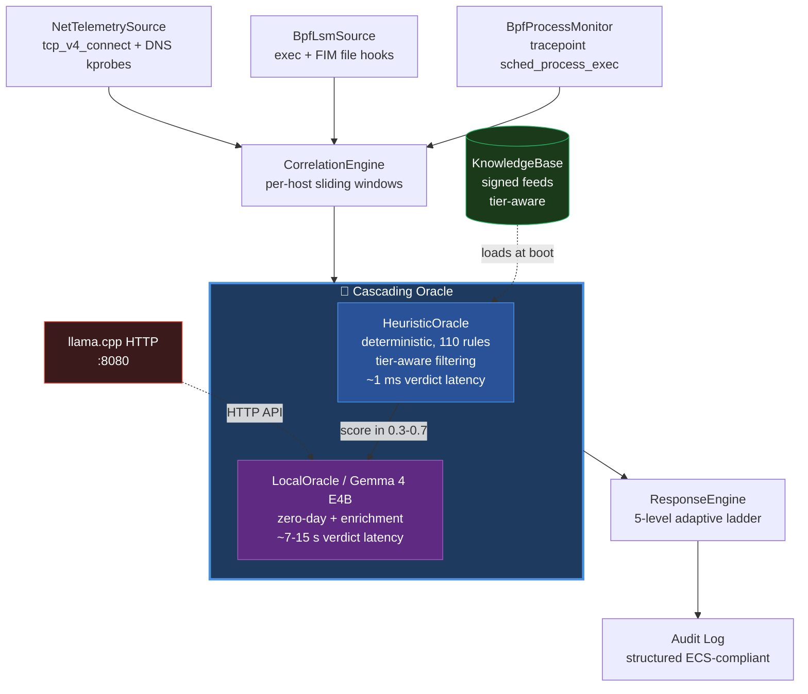

# 🛡️ NorthNarrow

**AI-powered Endpoint Detection & Response, engineered for air-gapped environments.**

*Heuristic precision meets local LLM reasoning — zero cloud dependencies, full data sovereignty.*

---

## 🎯 What is NorthNarrow?

NorthNarrow is a next-generation **EDR/XDR platform** written in Rust that combines two detection engines in a unique cascading architecture:

1. **Deterministic heuristic rules** — sub-millisecond detection of known attack patterns (110 curated rules across 9 detection families incl. file integrity monitoring, 50+ MITRE ATT&CK techniques)
2. **Local AI reasoning** — Gemma 4 LLM running entirely on-premise for zero-day detection, false-positive triage, and contextual threat naming

**No cloud. No telemetry leaks. No vendor lock-in.** Designed for environments where data sovereignty is non-negotiable: financial institutions, defense, healthcare, critical infrastructure, and regulated EU markets (GDPR, NIS2, eIDAS).

---

## 🚀 Why NorthNarrow?

| Problem | Traditional EDR | NorthNarrow |
|---------|-----------------|-------|
| Zero-day detection | Cloud ML — telemetry leaves the perimeter | Local LLM — bytes never leave the perimeter |
| False-positive fatigue | Threshold tuning hell | AI-enriched verdicts with reasoning |
| Air-gapped environments | Not supported / degraded mode | First-class citizen |
| Vendor lock-in | $50–200 per endpoint per year SaaS | Self-hosted, source-available |
| GDPR / NIS2 compliance | Requires DPIA + DPA per region | Compliant by architecture |

---

## ⚡ Key Differentiators

- 🧠 **Cascading Oracle** — Heuristic primary (1 ms deterministic) + LocalOracle/Gemma 4 secondary for ambiguous events. Verdicts are intelligently merged, never ping-ponged.
- 🔒 **100% Local Inference** — Gemma 4 E4B Q8 runs in-process via the agent's embedded `llama.cpp` Rust binding. Statically linked into the agent binary; no outbound API calls; no separate `llama-server` process; no `LD_LIBRARY_PATH`. Verifiable with `tcpdump`.
- 🎯 **Adaptive Response Ladder** — 5-level severity (`LOG → ALERT → THROTTLE → KILL → ISOLATE`), proportional to confidence × score.
- 🔗 **Per-host Correlation Engine** — Sliding windows with bounded memory, lock-free concurrent absorption, idle-host eviction.
- 🛡️ **Graceful Degradation** — If the AI server is unreachable, NorthNarrow falls back to heuristic-only mode without service interruption.
- 🧬 **eBPF-first telemetry** — process exec (tracepoint + LSM), file integrity (LSM file hooks), and network outbound (kprobe + DNS) all captured kernel-side. Sub-millisecond latency, no polling overhead.

---

## 🏗️ Architecture

---

## 🔭 Vision: 2-AI Architecture

NorthNarrow's roadmap centers on a **two-stream retrieval-augmented inference layer** that
moves the AI verdict from a stateless single-call pattern to a context-aware
dual-corpus reasoner:

- **RAG-LEGIT** — a curated corpus of *benign* process / file / network behavior baselines.
  When the LocalOracle evaluates an event, it retrieves nearest-baseline embeddings to
  judge how *unusual* the observation is relative to known-good activity on the host.
- **RAG-NOLEGIT** — a curated corpus of *malicious* tradecraft (CVE PoCs, APT TTPs,
  open-source malware), used as a positive-match retrieval channel orthogonal to the
  heuristic rules.

The verdict that flows back to the cascading oracle is a 2D score (anomaly vs. known-bad)
rather than a single confidence number, which makes the response engine's threshold
tuning explainable in terms of *which* corpus the event matched against.

The roadmap covering this layer is tracked as `M-AI-*` milestones (RAG infrastructure,
embedding store integration, retrieval prompt design, dual-stream fusion).

### Mid-term: decentralized threat-intelligence mesh

For cross-organization signature propagation — the dimension where centralized
vendors (CrowdStrike, SentinelOne, Microsoft Defender) own the moat today —
NorthNarrow's architectural endgame is a **decentralized mesh of authenticated
nodes** that share detection signatures via Byzantine Fault Tolerant consensus,
eliminating the single-vendor failure mode characteristic of the cloud-EDR
incumbents (cf. the CrowdStrike Falcon Sensor outage of 19 July 2024).

The architecture rests on five pillars: (1) **Sybil resistance via licensed
identity** (three-tier KYC: use-only / mesh-consumer / council-member, pricing
forged identities above what state-level attackers find economic);
(2) **Proof of Authority consensus** (7-node council per regional federation
with BFT 5-of-7 ratification, sub-second rounds via mature Tendermint-derived
primitives); (3) **Liability management** (EULA + cyber liability insurance +
NIS2/DORA alignment, designed-from-scratch to meet EU regulatory frontiers);
(4) **Sanitization at source + regional data residency** (EU/US/Asia clusters
with no default cross-jurisdiction telemetry flow; Schrems II compliance by
architecture); (5) **Shadow mode + circuit breaker** (4-stage rollout —
canary 5% → staged 50% → active 100% — with automatic rollback at 0.5% error
rate; Time-to-Alert 1-5 minutes, Time-to-Block 1-7 days).

Three-phase deployment: **2027** single-node + threat-intel pull (current
trajectory); **2028-2029** NorthNarrow-operated council bootstrap (transparent
centralized trust with auditable signing keys); **2030+** customer-governed
regional federations (EU banking, EU government, US critical infrastructure,
healthcare, journalism) with NorthNarrow Inc. as a peer rather than the root
authority. The successor-authority commitment — escrowed key material, defined
succession protocol — ensures customer endpoints remain operational independent
of NorthNarrow's corporate continuity. Vendor failure is a recoverable event,
not a systemic one.

The full internal architecture document (5 pillars elaborated, 3-phase rollout
detail, 6 open problems explicitly enumerated, EUR 80K-180K annual operational
baseline for compliance + insurance + legal) is **available to design partners
under NDA**. Reach out via the [Contact](#-contact) section if your
organization's threat model has "the EDR vendor controls our threat
intelligence" as a non-starter.

### Long-term: adversarial multi-agent training

The end-state vision is a **multi-agent training loop** — at least five specialized
agents (red-team simulators that generate novel attack chains, blue-team verifiers
that label heuristic+RAG verdicts, a referee that scores agreement, a curator that
promotes new rules into the signed KB feed, an adversary-of-the-adversary that
attempts to bypass the current detector) — running offline against captured event
traces. The output of each cycle is a hardened KB and a re-tuned RAG corpus, signed
and shipped to deployed agents through the existing signed-feed infrastructure.

This is forward-looking research, not a deployed feature. It is described here so
prospective design partners understand the architectural direction, not as a
commitment to ship by a specific date.

---

## 🚦 Project Status

> **Status: alpha / pre-release / pre-customer.**
> NorthNarrow source code lives in a private repository while the project matures to
> production quality. This public repo hosts architecture and detection-coverage
> documentation for transparency with the security community.

### What you can see today

- ✅ Full architecture and design rationale
- ✅ Complete list of 110 detection rules with MITRE mappings
- ✅ Threat intelligence references (CVEs, APT campaigns)
- ✅ Roadmap and milestone history
- ✅ Tech stack and performance metrics

### What is not yet public

- 🔒 Source code (`northnarrow-core`, `northnarrow-agent`, BPF crates)
- 🔒 Pre-built binaries
- 🔒 Detection rule definitions in machine-readable format

### Interested in design-partner discussion?

If you represent a security team, research lab, or organization with a use case
that aligns with NorthNarrow (air-gapped EDR, sovereign cloud, regulated industry),
reach out via the [Contact](#-contact) section below. The project is in alpha and
**actively looking for design partners** willing to co-evolve detection coverage
and deployment patterns against real workloads.

---

## 🎯 Detection Coverage

NorthNarrow ships with **110 curated detection rules** spanning the most common Linux attack patterns observed in 2024–2026 incident response reports. Every rule includes:

- ✅ A unique `NN-L-*` identifier for tracking and tuning
- ✅ A MITRE ATT&CK technique mapping (50+ unique techniques covered)
- ✅ A maturity tag (`stable` / `beta`) reflecting field validation
- ✅ An author tag for accountability

| Family | Count | MITRE Tactic | Highlights |
|--------|------:|--------------|------------|
| **Windows core** | 3 | TA0002 / TA0006 | PowerShell encoded, hidden window, Office macro |
| **Linux core** | 10 | TA0002 / TA0011 | Reverse shells, cryptominers, base64 staging, netcat |
| **CanisterWorm Suite** | 5 | TA0001 / TA0003 | Supply-chain worm (TeamPCP, March 2026): npm hooks, ICP canister C2, `deploy.js` self-propagation |
| **Initial Access** | 15 | TA0001 / TA0002 | Web/DB/mail RCE patterns (Log4Shell, Spring4Shell, CVE-2024-4577), container escape (CVE-2024-21626 runc), LOLBins, scripting interpreters |
| **Persistence** | 12 | TA0003 | systemd / cron / `.bashrc` / `LD_PRELOAD` / `authorized_keys` / `sshd_config` backdoors |
| **Privilege Escalation & Defense Evasion** | 10 | TA0004 / TA0005 | SUID/SGID, sudoers, kernel exploits (PwnKit, DirtyPipe, OverlayFS), capability abuse, log tampering, MAC disable |
| **Credential Access & Discovery** | 10 | TA0006 / TA0007 | `/etc/shadow`, browser cred DBs, SSH keys, AWS/GCP/Azure creds, kubeconfig, `/proc` memory dump, post-exploit toolkits |
| **Lateral Movement, C2 & Exfiltration** | 13 | TA0008 / TA0011 / TA0010 | SSH brute-force, agent forwarding, DNS tunneling, Tor, ngrok/cloudflared, socat, rclone, crypto wallets, Discord/Slack webhook exfil |
| **File Integrity Monitoring (M14)** | 9 | TA0040 / TA0003 / TA0006 | Ransomware extension rename, cron persistence, SSH `authorized_keys` tamper, `/etc/shadow` read, AWS/Azure/GCP/Docker credentials access, systemd unit drop. Backed by BPF LSM `file_open` + 4 `inode_*` hooks. |
| **Total** | **110** | | |

### Threat Intelligence References

Rules are not invented — every detection is backed by published research, CVEs, or documented APT campaigns:

- **CVE references**: CVE-2021-4034 (PwnKit), CVE-2022-0847 (DirtyPipe), CVE-2023-2640 (OverlayFS), CVE-2024-21626 (runc), CVE-2024-4577 (PHP-CGI), CVE-2019-10149 (Exim), CVE-2021-44228 (Log4Shell), CVE-2022-22965 (Spring4Shell)
- **Threat actors**: TeamPCP, Outlaw, Kinsing, TeamTNT, RotaJakiro, XorDDoS, APT29, Turla, APT41, Lazarus
- **Campaigns**: CanisterWorm (JFrog/Socket/Aikido, 2026), GlassWorm, Shai-Hulud
- **Frameworks**: MITRE ATT&CK v15, GTFOBins, PayloadsAllTheThings

---

## 🆚 NorthNarrow vs Existing Solutions

| Capability | Wazuh | Falco | CrowdStrike Falcon | **NorthNarrow** |
|-----------|:-----:|:-----:|:-----:|:-----:|
| Open / source-available | ✅ | ✅ | ❌ | ✅ |
| Local AI reasoning | ❌ | ❌ | Cloud only | ✅ |
| Air-gapped operation | ⚠️ | ✅ | ❌ | ✅ |
| Deterministic rules | ✅ (2000+ OSSEC) | ✅ (~50) | ✅ | ✅ (110 curated) |
| Per-rule MITRE mapping | Partial | Partial | ✅ | ✅ |
| Cascading verdict (heuristic + AI) | ❌ | ❌ | ❌ | ✅ |
| eBPF process + file + network | ⚠️ | ✅ (process+net) | ✅ | ✅ |
| Decentralized mesh consensus | ❌ | ❌ | ❌ | 📐 (designed) |
| Cost per endpoint per year | Free | Free | $50–200 | TBD |
| Memory-safe language | C / Python | Go / C++ | C++ | **Rust** |

---

## 🛣️ Milestone History

A transparent log of development progress.

### ✅ Milestones 1–7 — Foundations
Workspace skeleton, ECS-compliant event schema, Ed25519 signed envelope for KB
updates, sysinfo polling telemetry, per-host correlation engine with sliding
windows, 5-level adaptive response ladder, LocalOracle/Gemma 4 integration via
`llama.cpp`, cascading-oracle two-stage verdict pipeline. Initial 13-rule
detection set (3 Windows + 10 Linux core).

### ✅ Milestone 8 — Detection Coverage Expansion
Detection KB grown 6× (13 → 78 rules), 5 strategic families added, 50+ unique
MITRE techniques covered, real-world threat-intel references for every rule.

### ✅ Milestone 9 — Detection Coverage Hardening
100 detection rules total, 4-tier capability system (Free / Pro / Business /
Enterprise), 8 false-positive fixes from real-world audit.

### ✅ Milestone 10 — eBPF Process Tracepoint
- BPF tracepoint on `sched/sched_process_exec` (kernel 5.7+)
- `aya` 0.13 toolchain, full ProcessInfo capture (PID, PPID, comm, exec path)
- Runtime detection with sysinfo polling fallback when BPF unavailable
- Verified live end-to-end: kernel → BpfProcessMonitor → CorrelationEngine →
  CascadingOracle, zero events dropped

### ✅ Milestone 11 — BPF LSM Process Exec Enforcement
- LSM hook on `bprm_check_security` with kernel-side path resolution via
  `bpf_d_path` (allowed by the LSM BTF allowlist)
- Allowlist / denylist BPF policy maps, sub-microsecond lookup
- Schema v4 with structured `enforcement` field on every event
- Cascading-oracle fast-path: skip both heuristic and AI on Allowlisted
  (suppress) and Denied (high-confidence policy violation)
- 5/6 sub-phases shipped in ALERT mode; **M11.6 BLOCK mode** is deferred to a
  VM-only session because a bug in BLOCK mode can render a host unbootable

### ✅ Milestone 12 — Self-Protection
Watchdog supervisor (systemd `Restart=always` + custom fork-execv pattern with
async-signal-safe `_exit`), KB SHA-256 verification at boot, executable
self-hash for tamper-detection telemetry. Kernel-level integrity protections
groundwork.

### ✅ Milestone 13 — Network Telemetry
- **M13.1** TCP outbound capture via kprobe on `tcp_v4_connect`
- **M13.2** PID + remote tuple correlation through the existing CorrelationEngine
- **M13.3** DNS observability (raw query capture, Shannon entropy on QNAMEs
  for tunneling detection, per-PID rate limiting via token bucket)

### ✅ Milestone 14 — File Integrity Monitoring
*(Closed and runtime-validated.)*

- **M14.1** ✅ Design doc + scaffolding (FileEvent / FileEventKind types,
  ringbuf reservation, agent integration plan)
- **M14.2** ✅ BPF LSM file hooks attached: `file_open`, `inode_unlink`,
  `inode_rename`, `inode_create`, `inode_setattr`
- **M14.3** ✅ Userspace consumer + agent integration: unified `BpfLsmSource`
  drains both `EVENTS` (M11 exec) and `FILE_EVENTS` (M14 FIM) from a single
  loaded BPF object; events flow as `EcsEvent` with `event.action = file_*`
- **M14.4** ✅ Dentry-based path resolution for all four `inode_*` hooks
  plus 9-rule FIM correlation family in the `KnowledgeBase` (`NN-L-FIM-*`):
  ransomware mass-rename detection, persistence path tampering
  (`/etc/cron.*`, `/etc/systemd/system/*`, `~/.ssh/authorized_keys`),
  sensitive-file access (`/etc/shadow`), cloud credential theft
  (AWS/Azure/GCP/Docker), systemd unit drop.
- **VM-day #1 results**: 6/6 LSM programs loaded successfully on a real VM;
  7 of 7 testable FIM rules fire correctly under adversarial smoke. One rule
  (ransomware extension match on `inode_rename`) requires NEW-path emission
  that is deferred to a follow-up milestone — the underlying hook fires
  correctly, only the extension-pattern matching is gated by the deferred
  enhancement. Pipeline: 7,622 events produced = absorbed, zero drops.

### ✅ Milestone 14.7 — Manual Dentry Walk

A verifier-friendly replacement for `bpf_d_path()` on `inode_*` hook
contexts. The kernel BPF verifier rejects `bpf_d_path` when the `struct
path` argument is constructed on the BPF program stack (the typical
shape of a path built from a bare `dentry` plus the current task's
mount root). M14.7 walks the `dentry` chain manually using only
verifier-friendly helpers (`bpf_probe_read_kernel`,
`bpf_probe_read_kernel_str_bytes`), reverse-fills a 256-byte path
buffer with bitmasked variable offsets, and copies the resolved path
into the `FileEvent` ringbuf payload.

The walk is depth-bounded; the limit is set per kernel based on the
verifier's instruction budget (currently 12 components on the
production target kernel). Production detection rules all match against
paths within that depth, so the bound has no practical impact on rule
coverage today. Coverage analysis and verifier-iteration history live
in the internal design doc.

### ✅ Milestone 14.5 — Persistent Node Identity

Replaces transient agent identity (host UUID and Ed25519 keypair both
regenerated every boot, breaking audit-trail continuity) with persistent
identity stored in a state directory. UUID `host.id` resolves from
`/etc/machine-id` if available, falling back to a persisted UUID v4. The
Ed25519 keypair is stored as a raw 32-byte secret seed in `identity.key`
with mode 0600 and atomic write (`.tmp` + rename); deletion forces
regeneration with explicit operator intent (`rm`) rather than silent
every-boot drift.

State directory resolution follows a 4-step fallback (systemd
`$STATE_DIRECTORY` → `/var/lib/northnarrow` if root → XDG state home →
hard-fail with structured error). The systemd unit was bumped with
`StateDirectory=northnarrow` so production deployments inherit the
directory creation, ownership, and access rights from the unit
declaration. Unblocks license-tier persistence and signed-rule
infrastructure for future milestones.

### ✅ Foundational layer — production-ready

A 4-milestone batch elevating the agent from research-quality to
production-ready on the operational substrate.

- **Configuration:** TOML loader with typed `Config` struct, validation,
  and `northnarrow-cli config validate` + `dump-defaults` round-trip.
- **Persistent storage:** alerts and response-action history in an
  embedded redb 2.x database with a retention loop. Pure-Rust,
  single-file, MVCC; survives agent restarts.
- **Metrics:** Prometheus exposition on `127.0.0.1:9090`. Five
  ops-critical handles instrumented (event ingest rate, oracle
  decisions, response actions, storage pressure, watchdog restarts);
  more on the way.
- **Admin CLI (`northnarrow-cli`):** 8 subcommands (config, alerts,
  events, storage, status, version, ai), stable exit-code contract,
  JSON + table output modes, audit-trail-friendly.

All four milestones host-side runtime-validated.

### ✅ On-device LLM inference operational

The AI tier ships as a Rust-FFI wrapper around `llama.cpp` via the
`llama-cpp-4` crate, statically linked into the agent binary. No
`LD_LIBRARY_PATH`, no system-wide `libllama` install, no separate
`llama-server` process.

- **Configuration:** new `[ai.local_oracle]` section with `enabled`,
  `model_path`, `device`, `max_memory_mb`, `context_tokens`,
  `inference_timeout_ms`. `enabled = false` by default during alpha;
  operators opt in explicitly.
- **CPU-only at this stage** (`n_gpu_layers = 0`); GPU support is a
  future sub-milestone alongside `device = "gpu"` / `"auto"` config
  validation.
- **Memory budget enforcement:** post-load resident-set-size check
  against `max_memory_mb` × 1.5 (the 1.5× factor covers KV cache and
  sampler workspace). Misconfiguration surfaces a precise error
  message with the actual measured RSS, the configured budget, and a
  remediation hint (raise budget or use smaller quantization).
- **Greedy sampling** (temperature 0) for deterministic inference,
  matching the on-device verifiability story.
- **Per-call inference context** (no pool yet); a context pool to
  amortize KV cache build cost across the cascading-oracle path is
  planned.
- **Smoke ergonomics:** `northnarrow-cli ai test-prompt --model PATH
  <text>` for first-run validation. Operators can verify a fresh GGUF
  loads and infers without editing config TOML.

Runtime smoke validation: 6-scenario suite on the dev workstation
covering clean load + inference, missing-file error handling, invalid
config (rejected with forward reference to GPU sub-milestone), memory
budget enforcement, disabled-config behavior, and edge cases. End-to-end
inference confirmed against `Gemma 4 E4B-it Q8_K_XL.gguf`.

Two PARTIAL verdicts from the smoke suite trace to one acknowledged
NON-scope item — chat templating (`<start_of_turn>` / role tags) is
queued for the next sub-milestone in the AI-track batch. Without
templating, raw prompts trigger either immediate end-of-generation
(question-form prompts) or unbounded continuation (completion-form
prompts).

A pre-existing HTTP-based LocalOracle (talking to a separate
`llama-server` on `localhost:8080`) coexists transitionally and remains
the production oracle backend until the cascading-oracle path is
migrated to the in-process FFI engine.

### 📐 Milestone 15 — External Threat Intelligence Ingestion (designed)

Design committed; implementation queued post-VM-day. The complete design
spec covers 8 sub-milestones (M15.0 through M15.7, ~9-11 sessions
estimated, ~3200 LOC):

- **M15.0** Configuration loader (TOML + serde, with the same fallback
  pattern as the M14.5 state directory). Prerequisite for tunable feed
  URLs, refresh cadences, and operator-driven IoC source selection.
- **M15.1** New `northnarrow-threatintel` crate scaffolding + IoC types
  (file hashes, URLs, domains, IPs).
- **M15.2** Storage layer on **redb 3.x** — pure-Rust, single-file,
  transactional. Chosen over SQLite (libc dependencies) and sled
  (maintenance status). Anticipated 100k-1M IoC entries.
- **M15.3** First source adapter: **abuse.ch URLhaus** (malicious URL
  feed, ~1k entries refreshed every 5 minutes). OTX/MISP deferred to
  M15.8/M15.9 or M17 to keep M15 bounded.
- **M15.4** Polling scheduler with exponential backoff, jitter, and
  circuit-breaker for endpoint outages.
- **M15.5** Lookup API + IoC enricher — pre-correlation pipeline stage
  that adds `event.threat.indicators` to passing events. Zero rewrite
  of existing detection rules; the enrichment is purely additive.
- **M15.6** Five new `NN-L-IOC-001..005` detection rules to consume the
  enrichment output.
- **M15.7** Metrics + hardening + operator documentation (refresh
  state, last-fetch timestamps, error rates, redb compaction).

File hashing for the FIM events (matching the IoC store against actual
on-disk binaries) is intentionally deferred to M16 — keeps M15 scoped
to network-side intel.

---

## 🛠️ Tech Stack

| Layer | Technology | Why |
|-------|-----------|-----|
| Language | **Rust 1.95+** | Memory safety, performance, zero-cost abstractions |
| Async runtime | Tokio | De-facto standard for async Rust |
| LLM | **Gemma 4 E4B Q8_0** (4B params) | Best tradeoff between local-runnable size and reasoning quality |
| LLM serving | `llama.cpp` HTTP server | Mature, CPU-friendly, OpenAI-compatible API |
| Process telemetry | `aya` eBPF (kernel 5.7+) tracepoint + LSM + kprobe; `sysinfo` fallback | Sub-millisecond capture via BPF, universal fallback when BPF unavailable |
| Crypto | `ring` (Ed25519 signatures, SHA-256) | Audited, BoringSSL-backed. Integrity-first design. |
| Schema | Elastic Common Schema 8.11 | Industry-standard interoperability |
| Logging | `tracing` (structured) | Production-grade observability |
| Serialization | `serde` + `serde_json` | Standard Rust ecosystem |

---

## 📋 Current Status

🟠 **Alpha — pre-customer. AI inference path operational on dev hardware. Kernel telemetry stack runtime-validated end-to-end. Foundational layer (configuration, persistent storage, metrics, admin CLI) production-ready.**

| Metric | Value |
|--------|-------|
| Detection rules | **110** |
| MITRE techniques covered | **50+** |
| Test coverage | **267 tests passing** (unit + integration) |
| Supported OS | Linux (Ubuntu 24.04 LTS target, 22.04 supported, WSL2 dev). Windows planned future release |
| Detection latency (heuristic) | < 1 ms |
| Detection latency (LocalOracle, CPU) | 7–15 s on Ryzen 9 3900XT |
| Memory footprint (agent) | ~30 MB without LLM |
| Memory footprint (LLM) | ~9 GB (Gemma 4 E4B Q8 mmap'd, dev workstation observation) |
| Deployment | Single static-link binary; no `LD_LIBRARY_PATH`, no system `libllama` install, no separate `llama-server` process |

---

## 📬 Contact

NorthNarrow is in alpha and looking for **design partners** — security teams or
organizations willing to co-evolve detection coverage and deployment patterns
against real workloads.

For early-access evaluation, threat intelligence collaboration, or commercial
licensing inquiries:

- 🔗 **GitHub**: [@northnarrow](https://github.com/northnarrow) — open an issue
  in this repository for public discussion, or use Discussions for design-partner
  inquiries
- 💼 **LinkedIn**: *coming soon*
- 📧 **Email**: *coming soon*

> Currently building solo from Italy 🇮🇹. Responses may take 1–3 business days.

---

## 📜 License

**Proprietary. All rights reserved.**

NorthNarrow will transition to a dual-license model (AGPLv3 + commercial) upon
public release. Until then, all source code is provided for evaluation only and
may not be redistributed.

---

## ⚠️ Disclaimer

NorthNarrow is **alpha software** under active development. Detection rules are
validated against published threat intelligence, but no detection system can
guarantee 100% coverage of unknown threats. Use in production environments at
your own risk and always pair with defense-in-depth practices.

---

**Built in Rust. Engineered for sovereignty. Designed for the AI era.**

🇮🇹 Made with care in Italy

